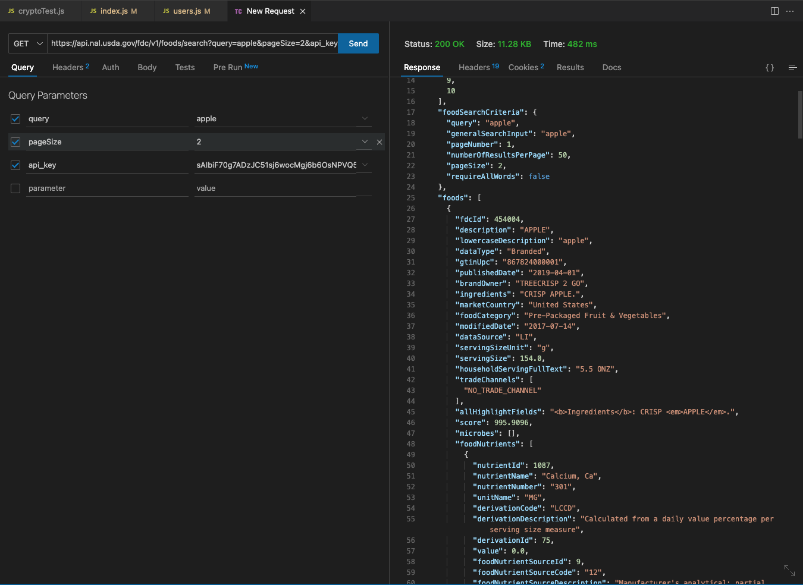

# RecipeBook

## Description
Ordering takeout or eating at a restaurant is becoming increasingly more expensive. In Seattle, Washington, I rarely find myself spending less than $15-20 on a meal, not including the gas and time it takes to get to the restaurant. Grocery shopping and cooking at home could potentially cut the cost per meal by over $10 while at the same time giving me a better understanding of what I'm putting in my body. But for someone like me with very little cooking experience, I'm always hesitant to get started even though I am interested. This application will hopefully give users like me inspiration to find good recipes to start cooking!

RecipeBook will be a hub to find your next recipe to try! This application allows users to post their recipes as well as browse through other users' recipes. RecipeBook also retrieves nutritional data from the FoodData Central API and includes information on the ingredients used in each recipe.

## API
FoodData Central API - 1000 requests per hour per API key

## ERD

## Restful Routing Chart

## Wireframes

## User Stories
1. As a user, I want to be able to browse through recipes for inspiration on what I want to cook.
2. As a user, I want the ability to post, update, and perhaps delete my own recipes.
3. As a user, I want to be able to see the nutritional data for a recipe's ingredient list so I can calculate nutritional values for each recipe.

## MVP Goals
1. System for user authentication and authorization. 
2. Form to create a profile 
3. Page to browse recipes 
4. Search for a recipe (header)
5. Form to create and update (if authorized) recipes.
6. Option to delete recipes, if authorized.
7. Show a specific recipe page, with all info/steps necessary.
8. A link on the specific recipe page to show the nutritional data on the ingredients used in this recipe.
 

## Stretch Goals
1. Allow users to post comments and ratings for recipe pages.
2. Allow users to post images of their recipes and their version in commments.
3. Implement a calculator for ingredient nutrition data for recipes.