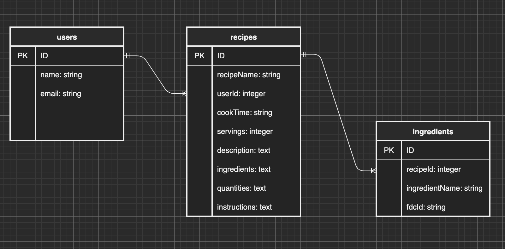
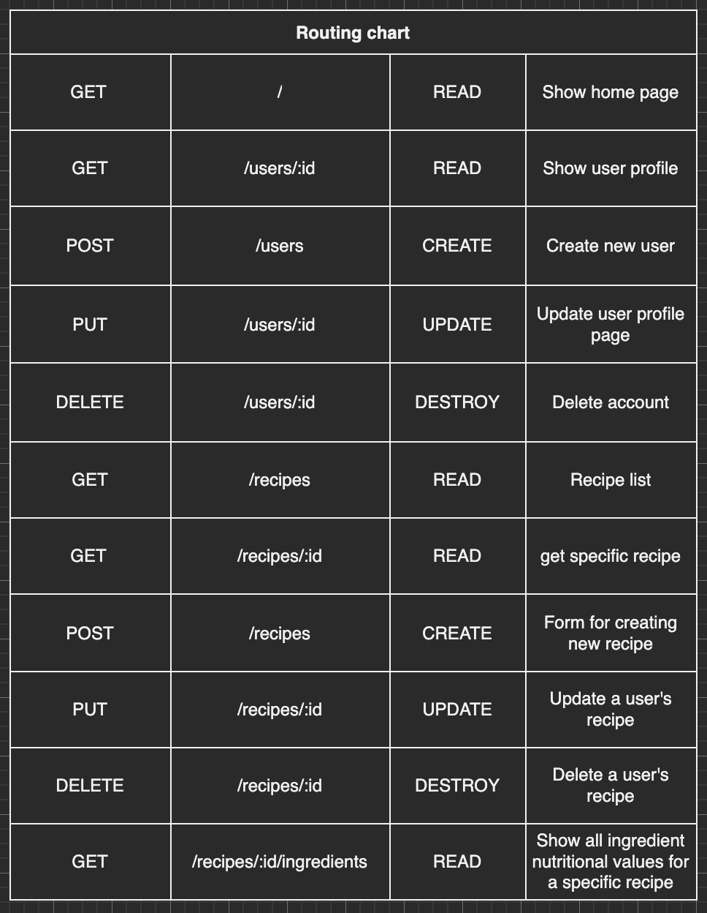
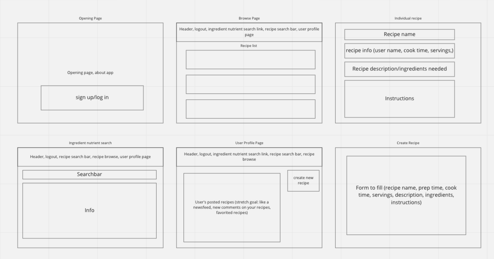

# RecipeBook

## Questions for Weston after Pitch processing: 
1. I'm somewhat unsure about the CRUD routes for my recipes. As you can see in my 2nd panel in my wireframe, I want someone to be able to browse (GET) recipes and also click on a recipe (GET) and see the instructions/info (3rd panel in my wireframe). For the routes, I thought it would be GET /recipes and GET /recipes:id respectively.   Then I thought about creating, updating and deleting a recipe. In the 5th panel I want a create recipe button on the user profile. I also wanted to put the list of all the user's recipes on their profile, with an update and delete "a" tag next to each recipe. Since it will be a specific user being able to create, update, and delete a recipe, my initial thought is that I would need to show that in my route, but I'm unsure. Suggestions/clarification on this would be super helpful!!

2. For my online api I chose to use FoodData Central API. I plan for there to be a link in my header that the user can click to bring them to a page where they can get extra information on the nutritional value of an ingredient they are curious about (panel 4 in wireframe). This would be in contrast to having all recipe ingredients stored in a separate model and populating the columns of that model with the FoodData Central API (which seemed too complicated for mvp so maybe a stretch goal- N:M ingredients to recipes).   I was wondering, since I can just axios.get the url and change the query string to whatever the user inputs (like we did in the pokedex), I thought I wouldn't have to create a model for the ingredients since I'm not storing my favorite ingredients or anything? But if this is the case and I dont have an ingredients model, would it make sense to make an ingredients route to show that erd page (panel 4 in wireframe)? Feel like I may be missing some fundamental concepts here because I'm definitely confused by this.

3. Don't fully have a grasp on how challenging or not this project would be. I'm definitely willing to be challenged to really learn these concepts but would appreciate feedback/recommendations on this.

## Description
Ordering takeout or eating at a restaurant is becoming increasingly more expensive. In Seattle, Washington, I rarely find myself spending less than $15-20 on a meal, not including the gas and time it takes to get to the restaurant. Grocery shopping and cooking at home could potentially cut the cost per meal by over $10 while at the same time giving me a better understanding of what I'm putting in my body. But for someone like me with very little cooking experience, I'm always hesitant to get started even though I am interested. This application will hopefully give users like me inspiration to find good recipes to start cooking!

RecipeBook will be a hub to find your next recipe to try! This application allows users to post their recipes as well as browse through other users' recipes. RecipeBook also includes an ingredient tracker which will give nutrition data on a searched ingredient. 

## API
FoodData Central API - 1000 requests per hour per API key

## ERD

## Restful Routing Chart

## Wireframes

## User Stories
1. As a user, I want to be able to browse through recipes for inspiration on what I want to cook.
2. As a user, I want the ability to post, update, and perhaps delete my own recipes.
3. As a user, I want to be able to search for nutrition data on the ingredients I'm using, so I can calculate nutrition facts for recipes.

## MVP Goals
1. System for user authentication and authorization. 
2. Form to create a profile 
3. Page to browse recipes 
4. Search for a recipe (header)
5. Form to create and update (if authorized) recipes.
6. Option to delete recipes, if authorized.
7. Show a specific recipe page, with all info necessary.
8. A page for users to search up ingredient nutrition data (hitting FoodData Central API)
 

## Stretch Goals
1. Allow users to post comments and ratings for recipe pages.
2. Allow users to post images of their recipes and their version in commments.
3. Implement a calculator for ingredient nutrition data for recipes.