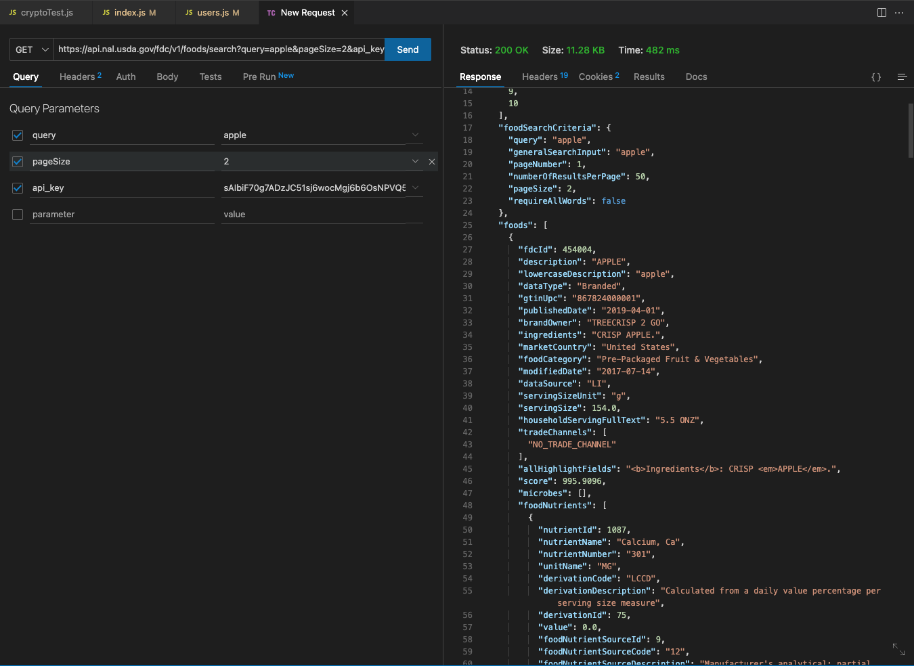
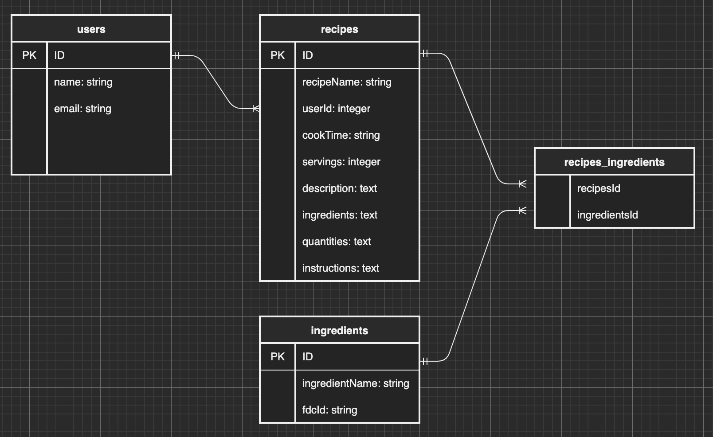
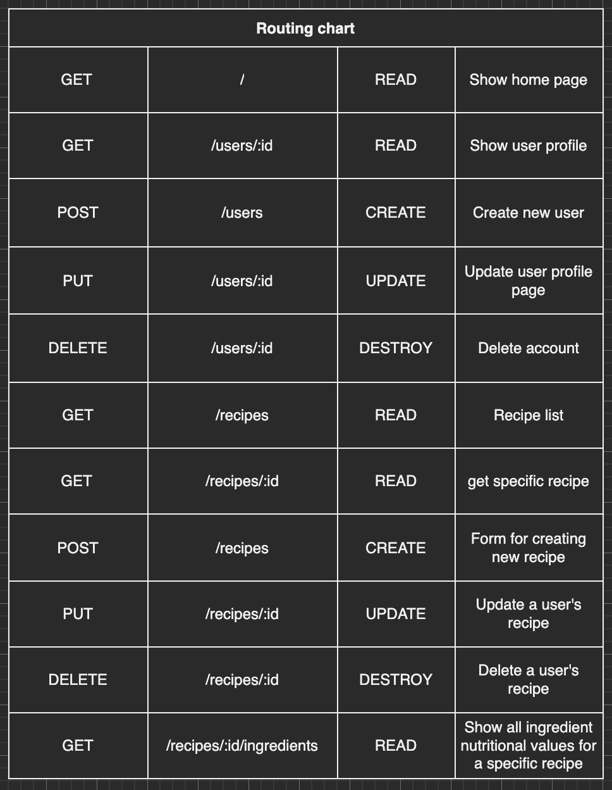
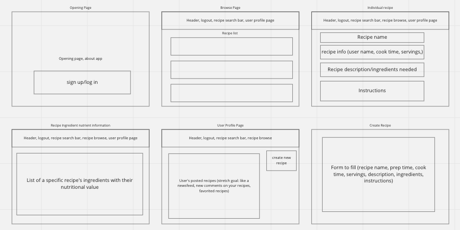

# RecipeBook

## Link to Deployed Live Site
https://project2-paulyjkim1.herokuapp.com/

## Description
Ordering takeout or eating at a restaurant is becoming increasingly more expensive. In Seattle, Washington, I rarely find myself spending less than $15-20 on a meal, not including the gas and time it takes to get to the restaurant. Grocery shopping and cooking at home could potentially cut the cost per meal by over $10 while at the same time giving me a better understanding of what I'm putting in my body. But for someone like me with very little cooking experience, I'm always hesitant to get started even though I am interested. This application will hopefully give users like me inspiration to find good recipes to start cooking!

RecipeBook will be a hub to find your next recipe to try! This application allows users to post their recipes as well as browse through other users' recipes. RecipeBook also retrieves nutritional data from the FoodData Central API and includes information on the ingredients used in each recipe.

## Installation instructions
1. Fork and clone this repository.
2. In terminal, run `npm init -y` to initialize npm.
3. Then run `npm i` to install all required npm packages.
4. Next run `touch .env`.
5. Then run `echo node_modules >> .gitignore` and `echo.env >> .gitignore`.
6. In the env file, type `SECRET='secret'` where 'secret' can be a string of your choosing.
7. Visit https://fdc.nal.usda.gov/api-key-signup.html and sign up to recieve an API_KEY.
8. Once your API_KEY has been sent to you, go to the env file again and type `API_KEY='key'` where 'key' is the API_KEY you received.
9. Back in your console, run `sequelize db:create` and `sequelize db:migrate` to create a database and migrate the models.
10. You will now have the database "auth_boilerplate" in psql.
11. In your console, type `psql` and `\c auth_boilerplate` to connect to the database.
12. In a separate console tab, run `npx nodemon` (or just `nodemon` if you installed it globally) to start the application.
13. Go to http://localhost:8000/ in a browser to use the application.

## Technologies Used
* HTML/CSS
* JavaScript: Node and Express to create website foundation
* PostgresQL
* Sequelize
* Bootstrap
* FoodData Central API

## API
FoodData Central API - 1000 requests per hour per API key

## ERD

## Restful Routing Chart

## Wireframes

## User Stories
1. As a user, I want to be able to browse through recipes for inspiration on what I want to cook.
2. As a user, I want the ability to post, update, and perhaps delete my own recipes.
3. As a user, I want to be able to see the nutritional data for a recipe's ingredient list so I can calculate nutritional values for each recipe.

## MVP Goals
1. System for user authentication and authorization. 
2. Form to create a profile 
3. Page to browse recipes 
4. Search for a recipe (header)
5. Form to create and update (if authorized) recipes.
6. Option to delete recipes, if authorized.
7. Show a specific recipe page, with all info/steps necessary.
8. A link on the specific recipe page to show the nutritional data on the ingredients used in this recipe.
 

## Stretch Goals
1. Allow users to post comments and ratings for recipe pages.
2. Allow users to post images of their recipes and their version in commments.
3. Implement a calculator for ingredient nutrition data for recipes.

## Post-Project Reflection
My MVP was completed by the deadline, which is something I'm proud of. One thing I can say with certainty is that this application has a very high ceiling of potential. There are so many more things I want to implement and I'm a bit disappointed I didn't get to touch on any of my stretch goals and that there is so much more potential styling additions I can make. However, I am feeling much more comfortable on RESTful routing and making the connections between the technologies used in order to create my app. I'm very content with how challenged I felt by some of the roadblocks/problem solving opportunities that I came accross during this project. This really helped me to hammer in some of the fundamentals in building a Node app. In the future I definitely want to revisit this project to add all the ideas I still have, but also to rework some of the features that didn't pan out exactly the way I expected them to.